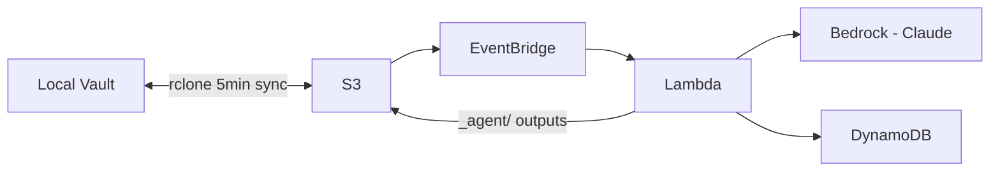

# CLAUDE.md

This file provides guidance to Claude Code (claude.ai/code) when working with code in this repository.

# Development workflow rules

- Always start work in a new git worktree. 
- Never commit or push changes directly to main, all changes must be submitted via PR.
- Before opening a new PR or pushing changes to an existing PR: Run all applicable tests and checks, including formatting and linting.
- After creating a PR: Wait for review comments, resolve them, and ensure all CI jobs pass before considering the work done.


## Project Overview

Serverless AWS system for Personal Knowledge Management (PKM). Automatically processes markdown documents from an Obsidian vault: classifies them, extracts entities, and generates daily summaries and weekly reports using Claude models via Amazon Bedrock.

## Common Commands

### Lambda (from `lambda/` directory)

```bash
cd lambda
bb test              # Run all unit tests
bb repl              # Start nREPL for interactive development
bb clean             # Remove build artifacts
```

Build Lambda functions (from `lambda/` directory):
```bash
bb build.clj                      # Build all functions
bb build.clj extract_metadata     # Build single function
```
Output ZIPs are placed in `lambda/target/`.

### iOS (from `ios/` directory)

```bash
cd ios
mise run test          # Run all tests (unit + UI)
mise run test:unit     # Run unit tests only (faster)
mise run lint          # Check code with SwiftLint
mise run lint:fix      # Auto-fix SwiftLint issues
mise run generate      # Regenerate Xcode project from project.yml
```

### macOS (from `macos/` directory)

```bash
cd macos
mise run test          # Run unit tests
mise run build         # Build for development
mise run lint          # Check code with SwiftLint
mise run lint:fix      # Auto-fix SwiftLint issues
mise run generate      # Regenerate Xcode project from project.yml
```

## Deployment

Deployments happen automatically via CI/CD after PRs are merged to `main`. Do NOT build or deploy manually. Instead:
1. Run tests locally (`bb test` in `lambda/`)
2. Commit to a feature branch and open a PR
3. CI runs tests and Terraform plan on the PR
4. After merge to `main`, CI builds, applies Terraform, and deploys

View Lambda logs (specify function name):
```bash
aws logs tail /aws/lambda/pkm-agent-classify-document --follow
```

## Architecture

- See `docs/ROADMAP.md` for current status and next steps.
- Task-based development workflow with numbered tasks in `docs/tasks/` directory.



**43 functions** in `lambda/functions/` (all Babashka/Clojure): 14 processing + 28 API + 1 CLI utility (`index_embeddings`). See `docs/architecture.md` for the complete function list with endpoints, memory, and timeout details.

**Bedrock Models** (defined in `terraform/variables.tf`):
- Haiku 4.5: Fast classification and extraction
- Sonnet 4.5: Summaries and reports

## Code Structure

```
lambda/
├── shared/aws/           # AWS SDK wrappers (bedrock.clj, dynamodb.clj, s3.clj, sns.clj, lambda.clj, secrets_manager.clj, brave_search.clj)
├── shared/api/           # API response utilities (response.clj)
├── shared/markdown/      # Markdown parsing utilities
├── shared/notifications/ # Notification dispatch utilities
├── shared/webhooks/      # Webhook signature verification and routing
├── shared/search/        # Vector search and semantic indexing
├── shared/command/       # Command parsing (parser.clj, context.clj)
├── shared/tasks/         # Task extraction (extractor.clj)
├── functions/            # 43 functions (14 processing + 28 API + 1 CLI utility)
└── tests/                # Unit tests (157 tests across 22 test files)

terraform/                # All AWS infrastructure
├── lambda.tf             # Processing Lambda functions
├── api_lambda.tf         # API Lambda functions
├── api_gateway.tf        # HTTP API Gateway with JWT auth
├── cognito.tf            # User Pool and Identity Pool
├── notifications.tf      # SNS/APNs push notification infrastructure
├── secrets.tf            # Secrets Manager resources
├── webhooks.tf           # Webhook receiving infrastructure
├── insights.tf           # Insights viewed tracking and counts
├── task_extraction.tf    # Task extraction pipeline
└── ...                   # S3, DynamoDB, EventBridge, Step Functions

scripts/                  # Deployment and testing
├── deploy.sh, setup-sync.sh, test-workflow.sh
├── test-api.sh           # API integration tests
├── create-cognito-user.sh # Create test users
├── configure-ios.sh      # iOS app configuration
├── cleanup-old-builds.sh # Remove old Lambda build artifacts
├── backfill.clj          # Backfill unprocessed S3 documents
├── bulk-reclassify.sh    # CLI for bulk reclassification
├── cleanup-orphans.clj   # Remove orphaned DynamoDB records
├── fix-dates.clj         # Fix document date metadata
└── index-embeddings.clj  # Build/update vector search index

ios/                      # iOS app (PKMReader)
├── PKMReader/            # SwiftUI app source
│   └── Core/Testing/     # Mock services for UI tests
├── PKMReaderTests/       # Unit tests, snapshots, performance benchmarks
├── PKMReaderUITests/     # UI tests (Page Object pattern)
├── fastlane/             # Build automation
└── project.yml           # XcodeGen project definition

macos/                    # macOS menu bar app (PKMSync / Sal Sync)
├── PKMSync/              # SwiftUI app source (MenuBarExtra)
│   ├── Core/             # Services (Sync, Scheduler, Conflicts, Configuration)
│   └── Features/         # MenuBar, Settings views and view models
├── PKMSyncTests/         # Unit tests and mocks
└── project.yml           # XcodeGen project definition

.github/workflows/        # CI/CD pipelines
├── build.yml             # Lambda build pipeline
├── test.yml              # Lambda test pipeline
├── ios-build.yml         # iOS build pipeline
├── ios-test.yml          # iOS test pipeline
├── macos-build.yml       # macOS build pipeline
├── macos-test.yml        # macOS test pipeline
└── claude.yml            # Claude Code automation
```

## Key Patterns

**Lambda Handler Pattern** (see `lambda/functions/extract_metadata/handler.clj`):
- Uses `bblf` (Babashka Lambda Framework)
- Receives S3 events via EventBridge
- Returns results to DynamoDB and/or S3 `_agent/` directory

**Bedrock Client** (`lambda/shared/aws/bedrock.clj`):
- Uses awyeah-api for AWS SDK
- Wraps Claude model invocation with retry logic

**Build System** (`lambda/build.clj`):
- Creates Lambda ZIPs with embedded Babashka binary and uberjar
- Uses `bblf` (Babashka Lambda Framework) for runtime
- Bootstrap script invokes `bb -jar lambda.jar -m bblf.runtime handler/handler`

**API Handler Pattern** (see `lambda/functions/api_list_documents/handler.clj`):
- Receives API Gateway events with JWT claims
- Uses `api.response` utilities for consistent responses
- Returns JSON with appropriate HTTP status codes
