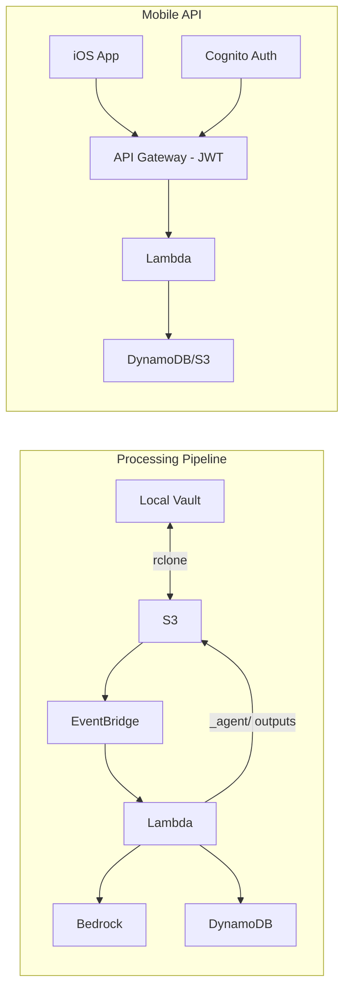

# PKM Agent System

An intelligent, serverless AWS system for automating Personal Knowledge Management (PKM) workflows. Automatically classifies documents, extracts entities, and generates daily summaries and weekly reports from your markdown vault.

## Features

- **Automatic Classification:** Categorizes documents as meetings, ideas, references, journals, or projects
- **Entity Extraction:** Identifies people, organizations, concepts, and locations
- **Daily Summaries:** Generates concise summaries of each day's activity (runs at 6 AM UTC)
- **Weekly Reports:** Creates comprehensive weekly reviews with themes and follow-ups
- **Bidirectional Sync:** Seamlessly syncs between local vault and AWS S3
- **Obsidian Compatible:** Works with standard Obsidian vault structure
- **Cost Effective:** ~$15-20/month for typical usage (50-100 docs/month)

## Architecture



**AWS Services Used:**
- **S3:** Vault storage (source of truth)
- **DynamoDB:** Metadata and entity index
- **Lambda:** 42 deployed Lambda functions (14 processing + 28 API) + 1 CLI utility
- **Bedrock:** Claude Haiku 4.5 and Sonnet 4.5 for AI capabilities
- **EventBridge:** Event routing and scheduling
- **Step Functions:** Workflow orchestration
- **CloudWatch:** Monitoring and logging
- **Cognito:** User authentication for mobile API
- **API Gateway:** REST API for iOS app

## Quick Start

### Prerequisites

- AWS Account with Bedrock access
- AWS CLI configured
- Terraform >= 1.5.0
- [Babashka](https://github.com/babashka/babashka) >= 1.3.0
- rclone

### Installation

```bash
# 1. Clone repository
git clone <repository-url>
cd pkm-agent-system

# 2. Deploy infrastructure
cd scripts
./deploy.sh

# 3. Set up vault sync
./setup-sync.sh

# 4. Test the system
./test-workflow.sh
```

**Total setup time:** ~15 minutes

## Documentation

- **[Setup Guide](docs/setup.md)** - Complete installation and configuration
- **[Architecture](docs/architecture.md)** - Technical architecture and design
- **[Sync Guide](docs/sync-guide.md)** - Vault synchronization setup
- **[Prompts](docs/prompts.md)** - Bedrock prompt templates
- **[User Guide](docs/USER_GUIDE.md)** - End-user documentation for the iOS app
- **[FAQ](docs/FAQ.md)** - Frequently asked questions
- **[Code Signing](docs/CODE_SIGNING.md)** - iOS code signing and distribution setup
- **[PRD](docs/prds/pkm-agent-system-prd.md)** - Complete product requirements

## Usage

### Creating Documents

Create markdown files in your local vault:

```markdown
---
title: Daily Notes
date: 2026-01-11
tags: [daily, journal]
---

# January 11, 2026

Today I worked on...

## Tasks
- [x] Deploy PKM agent
- [ ] Write first summary
```

### Automatic Processing

1. **Save file** → Syncs to S3 within 5 minutes
2. **S3 triggers processing:**
   - Classification (meeting/idea/reference/journal/project)
   - Entity extraction (people, orgs, concepts, locations)
   - Metadata parsing (tags, links, frontmatter)
3. **Results stored** in DynamoDB and S3
4. **Agent outputs** sync back to local `_agent/` directory

### Mobile API

The system includes a REST API for iOS app access:

| Endpoint | Description |
|----------|-------------|
| `GET /documents` | List documents with optional classification filter |
| `GET /documents/{key+}` | Get document with content |
| `POST /documents` | Create document (admin only) |
| `PUT /documents/{key+}` | Update document (admin only) |
| `DELETE /documents/{key+}` | Delete document (admin only) |
| `GET /search?q=...` | Search documents by title, path, tags (keyword/semantic) |
| `GET /tags` | List all tags with counts |
| `GET /tags/{tag}/documents` | Get documents by tag |
| `GET /classifications` | List classification types with counts |
| `GET /summaries` | List daily AI summaries |
| `GET /reports` | List weekly AI reports |
| `PUT /documents/classification/{key+}` | Update document classification |
| `POST /admin/reclassify` | Trigger bulk reclassification |
| `GET /graph` | Entity relationship graph data |
| `GET /searches` | List search monitors |
| `GET /searches/{id}` | Search monitor detail |
| `PUT /searches/{id}` | Update search monitor |
| `DELETE /searches/{id}` | Delete search monitor |
| `POST /searches` | Create search monitor |
| `GET /searches/{id}/summaries` | List search summaries |
| `POST /devices` | Register device for push notifications |
| `DELETE /devices/{device-id}` | Unregister device |
| `GET /notifications` | List pending notifications |
| `PUT /notifications/{id}/read` | Mark notification as read |
| `POST /webhooks/{source-id}` | Receive webhook payload |
| `POST /admin/webhook-sources` | Create webhook source (admin) |
| `GET /admin/webhook-sources` | List webhook sources (admin) |
| `PUT /admin/webhook-sources/{id}` | Update webhook source (admin) |
| `DELETE /admin/webhook-sources/{id}` | Delete webhook source (admin) |
| `GET /admin/webhook-events` | List received webhook events |
| `PUT /summaries/{date}/viewed` | Mark daily summary as viewed |
| `PUT /reports/{week}/viewed` | Mark weekly report as viewed |
| `PUT /insights/mark-all-viewed` | Mark all insights as viewed |
| `GET /insights/unviewed-count` | Get unviewed insights count |
| `POST /chat` | Send chat message (async command processing) |
| `GET /chat` | List conversations |
| `GET /chat/{conversationId}` | Get conversation messages |
| `GET /tasks` | List extracted tasks with filters |
| `GET /tasks/stats` | Task statistics (open/completed counts) |

**Authentication:** Cognito User Pool with JWT tokens

### Generated Outputs

Check the `_agent/` directory for:

```
_agent/
├── summaries/           # Daily summaries
│   └── 2026-01-11.md
├── reports/             # Weekly reports
│   └── weekly/
│       └── 2026-W02.md
├── entities/            # Extracted entities
│   ├── people/
│   │   └── alice.md
│   ├── organizations/
│   │   └── acme-corp.md
│   └── concepts/
│       └── machine-learning.md
└── classifications/     # Document index
    └── index.md
```

## Repository Structure

```
pkm-agent-system/
├── README.md              # This file
├── docs/                  # Documentation
│   ├── setup.md
│   ├── architecture.md
│   ├── sync-guide.md
│   ├── prompts.md
│   ├── ISSUES.md
│   └── tasks/             # Numbered task specifications
├── terraform/             # Infrastructure as Code
│   ├── main.tf
│   ├── s3.tf
│   ├── dynamodb.tf
│   ├── lambda.tf          # Processing Lambda functions
│   ├── api_lambda.tf      # API Lambda functions
│   ├── api_gateway.tf     # HTTP API Gateway
│   ├── cognito.tf         # User authentication
│   ├── notifications.tf   # SNS/APNs push notification infrastructure
│   ├── secrets.tf         # Secrets Manager resources
│   ├── webhooks.tf        # Webhook receiving infrastructure
│   ├── task_extraction.tf # Task extraction pipeline
│   ├── insights.tf        # Insights viewed tracking
│   ├── eventbridge.tf
│   ├── stepfunctions.tf
│   ├── iam.tf
│   ├── cloudwatch.tf
│   ├── variables.tf
│   └── outputs.tf
├── lambda/                # Lambda functions (Babashka/Clojure)
│   ├── bb.edn             # Babashka configuration
│   ├── build.clj          # Build script
│   ├── shared/            # Shared utilities
│   │   ├── aws/           # AWS SDK wrappers (bedrock, dynamodb, s3, sns, lambda, secrets_manager, brave_search)
│   │   ├── api/           # API response utilities
│   │   ├── markdown/      # Markdown parsing
│   │   ├── notifications/ # Push notification utilities
│   │   ├── webhooks/      # Webhook signature verification
│   │   ├── command/       # Command parsing (parser, context)
│   │   ├── tasks/         # Task extraction
│   │   └── search/        # Vector search and semantic indexing
│   ├── functions/         # Lambda function implementations
│   │   ├── classify_document/
│   │   ├── extract_entities/
│   │   ├── extract_metadata/
│   │   ├── generate_daily_summary/
│   │   ├── generate_weekly_report/
│   │   ├── update_classification_index/
│   │   ├── bulk_reclassify/
│   │   ├── delete_document/
│   │   ├── persistent_search_execute/
│   │   ├── persistent_search_summarize/
│   │   ├── index_embeddings/          # CLI utility (not deployed)
│   │   ├── api_list_documents/
│   │   ├── api_get_document/
│   │   ├── api_search/
│   │   ├── api_list_tags/
│   │   ├── api_documents_by_tag/
│   │   ├── api_list_classifications/
│   │   ├── api_list_summaries/
│   │   ├── api_list_reports/
│   │   ├── api_update_classification/
│   │   ├── api_bulk_reclassify/
│   │   ├── api_create_document/
│   │   ├── api_update_document/
│   │   ├── api_delete_document/
│   │   ├── api_graph_data/
│   │   ├── api_search_monitors/
│   │   ├── api_search_monitor_detail/
│   │   ├── api_search_summaries/
│   │   ├── notification_dispatch/
│   │   ├── api_device_tokens/
│   │   ├── api_notifications/
│   │   ├── webhook_receive/
│   │   ├── api_webhook_sources/
│   │   ├── api_webhook_events/
│   │   ├── api_insights_count/
│   │   ├── api_mark_viewed/
│   │   ├── command_process/
│   │   ├── extract_tasks/
│   │   ├── api_chat_list/
│   │   ├── api_chat_messages/
│   │   ├── api_chat_send/
│   │   ├── api_tasks/
│   │   └── api_tasks_stats/
│   └── tests/             # Unit tests
├── ios/                   # iOS app (SwiftUI)
├── scripts/               # Deployment and setup scripts
│   ├── deploy.sh
│   ├── setup-sync.sh
│   ├── test-workflow.sh
│   ├── test-api.sh        # API integration tests
│   ├── create-cognito-user.sh
│   ├── configure-ios.sh   # iOS app configuration
│   ├── cleanup-old-builds.sh # Remove old Lambda build artifacts
│   ├── backfill.clj       # Backfill unprocessed documents
│   ├── bulk-reclassify.sh # Bulk reclassification CLI
│   ├── cleanup-orphans.clj # Remove orphaned DynamoDB records
│   ├── fix-dates.clj      # Fix document date metadata
│   └── index-embeddings.clj # Build/update vector search index
└── sync/                  # Sync configuration
    └── README.md
```

## Configuration

### Customize Schedules

Edit `terraform/variables.tf`:

```hcl
variable "daily_summary_schedule" {
  default = "cron(0 6 * * ? *)"  # 6 AM UTC
}

variable "weekly_report_schedule" {
  default = "cron(0 20 ? * SUN *)"  # 8 PM UTC Sunday
}
```

### Adjust Lambda Resources

Edit `terraform/lambda.tf`:

```hcl
resource "aws_lambda_function" "classify_document" {
  timeout     = 30
  memory_size = 512
}
```

### Change AI Models

Edit `terraform/variables.tf`:

```hcl
variable "bedrock_haiku_model_id" {
  default = "global.anthropic.claude-haiku-4-5-20251001-v1:0"
}

variable "bedrock_sonnet_model_id" {
  default = "global.anthropic.claude-sonnet-4-5-20250929-v1:0"
}
```

## Monitoring

### CloudWatch Dashboard

```bash
# Get dashboard URL
cd terraform
terraform output cloudwatch_dashboard_url
```

### View Lambda Logs

```bash
# Tail logs for a specific function
aws logs tail /aws/lambda/pkm-agent-classify-document --follow
```

### Check Sync Status

```bash
# macOS
tail -f ~/.pkm-sync.log

# Linux
journalctl --user -u pkm-sync.service -f
```

## Cost Breakdown

**Estimated monthly cost for 100 documents:**

| Service | Cost |
|---------|------|
| S3 Storage & Requests | $0.50 |
| DynamoDB (on-demand) | $1.50 |
| Lambda Invocations | $3.00 |
| Bedrock (Haiku) | $0.50 |
| Bedrock (Sonnet) | $5.00 |
| CloudWatch | $2.00 |
| EventBridge | $0.10 |
| **Total** | **~$12.60** |

**Scales linearly:** ~$25/month for 200 docs, ~$50/month for 500 docs

## Troubleshooting

### Issue: Bedrock "Access Denied"

**Solution:** Enable model access in Bedrock console
```bash
# Navigate to AWS Console → Amazon Bedrock → Model access
# Enable Claude Haiku 4.5 and Claude Sonnet 4.5
```

### Issue: Sync Not Working

**Solution:**
```bash
# Test rclone connection
rclone lsd pkm-s3:BUCKET_NAME

# Check AWS credentials
aws sts get-caller-identity

# Reinitialize sync
rclone bisync /path/to/vault pkm-s3:BUCKET_NAME --resync
```

### Issue: No Agent Outputs

**Solution:**
1. Check CloudWatch logs for errors
2. Verify EventBridge rules are enabled
3. Test Lambda manually:
   ```bash
   aws lambda invoke \
     --function-name pkm-agent-classify-document \
     --payload '{"test": "event"}' \
     response.json
   ```

## Development

### Running Tests

```bash
# Run all tests with Babashka
cd lambda
bb test
```

### Local Development

```bash
# Start REPL for interactive development
cd lambda
bb repl

# Test utilities in REPL
(require '[markdown.utils :as md])
(md/extract-frontmatter "---\ntitle: Test\n---\nContent")
```

### Updating Infrastructure

```bash
cd terraform
terraform plan
terraform apply
```

## Roadmap

- [x] Core document processing
- [x] Daily summaries
- [x] Weekly reports
- [x] Entity extraction
- [x] Classification index
- [x] Mobile API (Cognito + API Gateway)
- [x] iOS app foundation (Phase 0-2)
- [x] iOS enhanced features (Search, Tags, Insights, Settings)
- [x] iOS test coverage (unit tests, UI tests, mock API)
- [x] Classification system improvements (enhanced prompts, feedback API, bulk reclassify)
- [x] iOS polish & release (error handling, accessibility, snapshot tests, App Store)
- [x] Backfill pre-existing documents
- [x] Document deletion cleanup
- [x] Semantic search (in-memory vector index with cosine similarity)
- [x] Write support & admin API (create, update, delete documents)
- [x] Knowledge graph visualization (force-directed graph in iOS)
- [x] Insights calendar design (monthly calendar grid)
- [x] Persistent search monitors (Brave Search API, AI summarization)
- [x] Persistent search UI (iOS views for search monitors)
- [x] iOS UI improvements (front matter stripping, checkboxes, wikilinks)
- [x] Secrets management (centralized Terraform secrets, multi-key caching)
- [x] Unified documents view (merged Documents, Search, Tags into single tab)
- [x] Push notifications (SNS/APNs for summaries, reports, search monitors)
- [x] Webhook receiving & classification
- [x] Interactive chat interface (@sal commands, chat API)
- [x] Task extraction and tracking
- [ ] Email/calendar integration

## Contributing

Contributions welcome! Please:

1. Fork the repository
2. Create a feature branch
3. Add tests for new functionality
4. Submit a pull request

## License

MIT License - See LICENSE file for details

## Support

- **Documentation:** See `/docs` directory
- **Issues:** GitHub Issues
- **Questions:** GitHub Discussions

## Acknowledgments

- Built with [Amazon Bedrock](https://aws.amazon.com/bedrock/)
- Inspired by [Obsidian](https://obsidian.md/)
- Sync powered by [rclone](https://rclone.org/)

---

**Created with Claude Code** | [View PRD](docs/prds/pkm-agent-system-prd.md)
