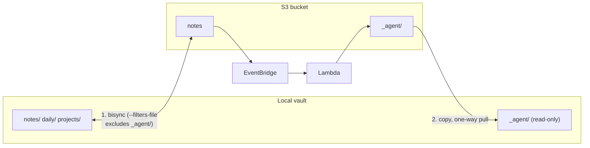

# Vault Synchronization Guide

This guide covers setting up and troubleshooting vault synchronization between your local devices and S3.

For detailed setup instructions, see [`sync/README.md`](../sync/README.md).

## Quick Start

```bash
# Run the setup script
cd scripts
./setup-sync.sh
```

## How Sync Works

Sync runs in **two phases**, because the vault holds two kinds of content with
different ownership:



**Phase 1 — notes.** `rclone bisync`, bidirectional, with `_agent/` and
Obsidian working state filtered out via `sync/pkm-bisync-filter.txt`.

**Phase 2 — `_agent/`.** `rclone copy` from S3 to local only. S3 is
unconditionally authoritative: a local edit under `_agent/` is overwritten on
the next pull and is never pushed back.

Both phases run from `sync/pkm-sync.sh` (or from the PKMSync menu bar app).

### Why split them

- Agent output can never be clobbered by a local edit, and can never produce a
  `.conflict` file.
- Lambda writes to `_agent/` constantly (every document PUT triggers entity
  extraction). Keeping that prefix out of bisync means those writes cannot
  land mid-run and destabilise bisync's listing state.
- The one-way pull is cheaper than bisync: no listing snapshots, no lock, no
  `check-sync`, and `--use-server-modtime` avoids a HEAD request per object.
- `_agent/entities/` grows one file per unique entity, so this is the part of
  the vault that scales badly under bisync.

### Sync Frequency
- **macOS/Linux:** Every 5 minutes (automatic)
- **iOS:** Hourly or on-demand (using Obsidian plugin)
- **Manual:** On-demand via command line

### Conflict Resolution
- **Strategy:** Newer file wins
- **Conflict handling:** Older file renamed to `filename.conflict`
- **Location:** Conflicts appear in both local and S3
- **Scope:** Notes only — `_agent/` cannot conflict

### Filters

The filters file lives at `~/.config/rclone/pkm-bisync-filter.txt` (installed
by `setup-sync.sh` from `sync/pkm-bisync-filter.txt`).

> **Always pass it with `--filters-file`, never `--filter-from`.** Only
> `--filters-file` makes bisync MD5-hash the rules and abort demanding a
> `--resync` when they change. Without that guard, files you newly exclude look
> *deleted* to bisync — and bisync deletes them for real, on both sides.

After editing the filters file, run a `--resync` before the next scheduled sync.

## Platform-Specific Setup

### macOS

#### Option 1: PKMSync Menu Bar App (Recommended)

The **PKMSync** (Sal Sync) menu bar app provides a native GUI for managing rclone sync. It shows sync status, supports configurable intervals, conflict detection/resolution, and recently modified file links. See `macos/` for the source and `macos/.mise.toml` for build/test commands.

#### Option 2: launchd (CLI-only)

Uses **launchd** for automatic sync:

```bash
# Setup (run setup-sync.sh or manually):
cp sync/com.pkm.sync.plist.template ~/Library/LaunchAgents/com.pkm.sync.plist

# Edit file to replace USERNAME and BUCKET_NAME
nano ~/Library/LaunchAgents/com.pkm.sync.plist

# Load and start
launchctl load ~/Library/LaunchAgents/com.pkm.sync.plist
launchctl start com.pkm.sync

# Check status
launchctl list | grep pkm.sync

# View logs
tail -f ~/.pkm-sync.log
tail -f ~/.pkm-sync-error.log

# Stop sync
launchctl stop com.pkm.sync
launchctl unload ~/Library/LaunchAgents/com.pkm.sync.plist
```

### Linux

Uses **systemd** timers:

```bash
# Create service files
mkdir -p ~/.config/systemd/user
nano ~/.config/systemd/user/pkm-sync.service
nano ~/.config/systemd/user/pkm-sync.timer

# Enable and start
systemctl --user daemon-reload
systemctl --user enable pkm-sync.timer
systemctl --user start pkm-sync.timer

# Check status
systemctl --user status pkm-sync.timer
systemctl --user status pkm-sync.service

# View logs
journalctl --user -u pkm-sync.service -f

# Stop sync
systemctl --user stop pkm-sync.timer
systemctl --user disable pkm-sync.timer
```

### iOS

#### Option 1: Obsidian + Remotely Save Plugin (Recommended)

1. Install Obsidian for iOS
2. Open your vault in Obsidian
3. Install "Remotely Save" community plugin
4. Configure plugin settings:
   - Remote: Amazon S3
   - S3 Endpoint: `s3.amazonaws.com`
   - Region: Your AWS region (e.g., `us-east-1`)
   - Bucket: Your bucket name
   - Access Key ID: From AWS IAM
   - Secret Access Key: From AWS IAM
   - Prefix: (leave empty)
5. Enable auto-sync:
   - Sync on open: ✓
   - Sync interval: 60 minutes
   - Sync on file change: ✓

**Creating IAM Credentials for iOS:**
```bash
aws iam create-access-key --user-name your-username
```

Save the Access Key ID and Secret Access Key securely.

#### Option 2: a-Shell + rclone (Advanced)

For users comfortable with command-line tools on iOS.

See [sync/README.md](../sync/README.md) for detailed instructions.

### Windows

Uses **Task Scheduler**:

1. Create batch file `pkm-sync.bat`:
   ```batch
   @echo off
   rclone bisync C:\path\to\vault pkm-s3:BUCKET_NAME ^
     --filters-file %USERPROFILE%\.config\rclone\pkm-bisync-filter.txt ^
     --conflict-resolve newer --conflict-loser rename
   rclone copy pkm-s3:BUCKET_NAME/_agent C:\path\to\vault\_agent ^
     --use-server-modtime --exclude "search/vector-index.json" --exclude "dispatch/**"
   ```

2. Create scheduled task:
   - Open Task Scheduler
   - Create Basic Task → "PKM Sync"
   - Trigger: Daily, repeat every 5 minutes
   - Action: Start program → Select `pkm-sync.bat`

## Manual Sync Commands

### Initial Setup (First Time)

```bash
# Initialize bisync (required before first sync)
rclone bisync /path/to/vault pkm-s3:BUCKET_NAME \
  --filters-file ~/.config/rclone/pkm-bisync-filter.txt \
  --resync
```

### Regular Sync

The wrapper runs both phases and reports a non-zero exit if either fails:

```bash
PKM_VAULT_PATH=/path/to/vault PKM_BUCKET_NAME=BUCKET_NAME ~/.local/bin/pkm-sync.sh
```

Or run the phases directly:

```bash
# Phase 1: notes, bidirectional
rclone bisync /path/to/vault pkm-s3:BUCKET_NAME \
  --filters-file ~/.config/rclone/pkm-bisync-filter.txt \
  --conflict-resolve newer \
  --conflict-loser rename \
  --recover --resilient --max-lock 2m \
  --verbose

# Phase 2: _agent/, one-way pull (remote authoritative)
rclone copy pkm-s3:BUCKET_NAME/_agent /path/to/vault/_agent \
  --use-server-modtime \
  --exclude "search/vector-index.json" \
  --exclude "dispatch/**" \
  --verbose
```

### Dry Run (Test)

```bash
# See what would change without making changes
rclone bisync /path/to/vault pkm-s3:BUCKET_NAME \
  --filters-file ~/.config/rclone/pkm-bisync-filter.txt \
  --dry-run --verbose
```

## Troubleshooting

### Error: "bisync is in a bad state"

**Cause:** Previous sync interrupted or conflicts not resolved

**Solution:**
```bash
# Resync (this will resolve conflicts by using newer files)
rclone bisync /path/to/vault pkm-s3:BUCKET_NAME \
  --filters-file ~/.config/rclone/pkm-bisync-filter.txt --resync
```

### Error: "Access Denied" when syncing

**Cause:** AWS credentials not configured or insufficient permissions

**Solution:**
```bash
# Verify AWS credentials
aws configure list
aws sts get-caller-identity

# Test S3 access
aws s3 ls s3://BUCKET_NAME
```

### Error: "No transfer found"

**Cause:** rclone not found in PATH

**Solution:**
```bash
# Verify rclone installation
which rclone
rclone version

# If not found, install:
# macOS: brew install rclone
# Linux: curl https://rclone.org/install.sh | sudo bash
```

### Sync Running Too Slowly

**Cause:** Large number of files or slow network

**Solutions:**
1. Add exclusions to `~/.config/rclone/pkm-bisync-filter.txt`, then run a
   `--resync` (bisync will otherwise abort — that is the filter-change guard).
2. Reduce sync frequency (edit launchd/systemd interval, or PKMSync settings).
3. Once `_agent/` dominates the object count, consider adding `--disable ListR`
   to the bisync phase. bisync uses `--fast-list` by default on S3, and rclone
   only prunes excluded *directories* when **not** using fast-list — so today
   `_agent/` keys are still enumerated by `ListObjectsV2` even though they are
   filtered out of the comparison. Measure before changing this: with a small
   note tree, fast-list is one LIST call and wins.

### Conflicts Keep Appearing

**Cause:** Multiple devices modifying same file simultaneously

**Solutions:**
1. Reduce sync frequency on one device
2. Use different files/directories per device
3. Manually resolve conflicts:
   ```bash
   # Find conflicts
   find /path/to/vault -name "*.conflict*"

   # Review and delete or rename as needed
   ```

### iOS Sync Not Working

**Obsidian + Remotely Save:**
1. Check AWS credentials in plugin settings
2. Verify bucket name and region
3. Test connection in plugin settings
4. Check Obsidian logs: Settings → Remotely Save → Debug

**Network Issues:**
- Ensure cellular data allowed for Obsidian
- Check if VPN interfering
- Verify S3 bucket accessibility

### Agent Outputs Not Syncing Back

`_agent/` is pulled by phase 2, not by bisync, so a bisync `--resync` will not
fix this. Check the pull directly:

```bash
# Verify S3 contents
aws s3 ls s3://BUCKET_NAME/_agent/ --recursive

# Run the pull on its own
rclone copy pkm-s3:BUCKET_NAME/_agent /path/to/vault/_agent \
  --use-server-modtime --verbose

# Confirm it landed
ls /path/to/vault/_agent
```

Note that `_agent/search/vector-index.json` and `_agent/dispatch/**` are
excluded on purpose — they are machine artifacts, not notes.

### Local Edits Under `_agent/` Disappear

Working as designed. S3 is authoritative for `_agent/`; the pull overwrites
local changes and never pushes them. Agent output is also ignored by
EventBridge and the processing Lambdas, so editing it has no effect anyway.
Copy the content into a real note instead.

## Monitoring Sync

### Check Last Sync Time

```bash
# macOS (launchd)
stat ~/.pkm-sync.log

# Linux (systemd)
systemctl --user status pkm-sync.timer

# Check S3 bucket last modified
aws s3api head-object --bucket BUCKET_NAME --key path/to/file.md
```

### View Sync Logs

```bash
# macOS
tail -f ~/.pkm-sync.log

# Linux
journalctl --user -u pkm-sync.service -f

# rclone verbose output
rclone bisync /path/to/vault pkm-s3:BUCKET_NAME \
  --filters-file ~/.config/rclone/pkm-bisync-filter.txt --verbose --dry-run
```

### Sync Statistics

```bash
# Count files in vault
find /path/to/vault -name "*.md" | wc -l

# Count files in S3
aws s3 ls s3://BUCKET_NAME --recursive | grep "\.md$" | wc -l

# Compare sizes
du -sh /path/to/vault
aws s3 ls s3://BUCKET_NAME --recursive --human-readable --summarize
```

## Best Practices

1. **Regular Backups:** S3 versioning is enabled, but backup locally too
2. **Test Conflicts:** Intentionally create conflicts to understand behavior
3. **Monitor Logs:** Check logs weekly for errors
4. **Exclude Unnecessary Files:** Don't sync temporary files
5. **Use Tags:** Tag files to track which device created them
6. **Limit Concurrent Edits:** Avoid editing same file on multiple devices
7. **Resolve Conflicts Promptly:** Don't let conflicts accumulate

## Advanced Configuration

### Custom Filters

Edit `~/.config/rclone/pkm-bisync-filter.txt` and add rules, then run a
`--resync`. Do not replace `--filters-file` with `--exclude`/`--filter-from`:
those bypass bisync's filter-change guard and can delete newly excluded files
on both sides.

Keep the `_agent/` rules — phase 2 owns that prefix.

### Bandwidth Limiting

Useful on metered connections:
```bash
rclone bisync /path/to/vault pkm-s3:BUCKET_NAME \
  --filters-file ~/.config/rclone/pkm-bisync-filter.txt \
  --bwlimit 1M  # Limit to 1 MB/s
```

### Compression

Enable compression for faster transfers:
```bash
rclone bisync /path/to/vault pkm-s3:BUCKET_NAME \
  --filters-file ~/.config/rclone/pkm-bisync-filter.txt \
  --s3-upload-cutoff 0 \
  --s3-chunk-size 5M
```

## Security Considerations

1. **AWS Credentials:** Never commit credentials to git
2. **IAM Permissions:** Use minimal permissions (S3 read/write only)
3. **MFA:** Enable MFA on AWS account
4. **Encryption:** S3 server-side encryption enabled by default
5. **rclone Config:** Protect rclone config file (chmod 600)

## FAQ

**Q: Can I sync multiple vaults?**
A: Yes, create separate rclone remotes and S3 buckets for each vault.

**Q: What if I delete a file locally?**
A: It will be deleted from S3 on next sync (and vice versa).

**Q: Can I sync to multiple S3 buckets?**
A: Yes, run separate bisync commands for each bucket.

**Q: Is there a web interface?**
A: No, but you can access files via AWS Console S3 browser.

**Q: Can I share my vault with others?**
A: Yes, grant them IAM access to the S3 bucket. Each user needs their own sync setup.

## References

- [rclone Documentation](https://rclone.org/docs/)
- [rclone bisync Guide](https://rclone.org/bisync/)
- [AWS S3 Documentation](https://docs.aws.amazon.com/s3/)
- [Obsidian Remotely Save Plugin](https://github.com/remotely-save/remotely-save)
